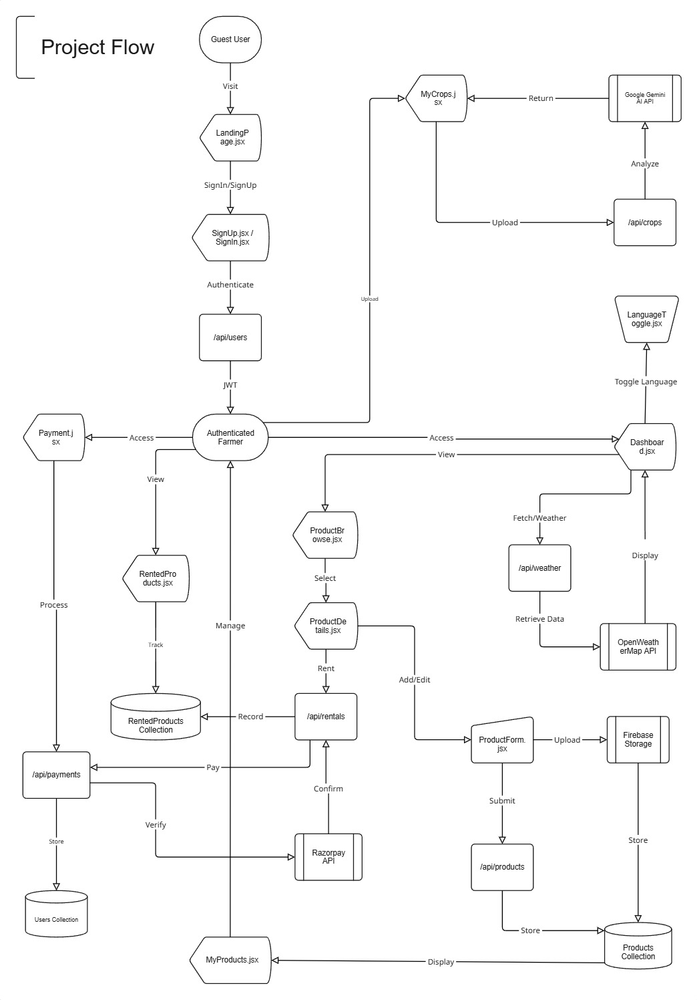

# AgriShare - Agriculture Management System

AgriShare is a modern Agriculture Management System that enables farmers to rent equipment, browse products, access weather forecasts, and receive crop care advice. The system supports multi-language accessibility and secure payment options.

---

## Features

- **Equipment Rental**: Farmers can browse and rent equipment.
- **Product Browsing**: Explore and purchase agricultural products.
- **Crop Care Advice**: Uses Gemini API for image-based crop analysis.
- **Weather Forecasting**: Get current day weather and 5-day forecasts with OpenWeatherMap API.
- **Farmer Dashboard**: Includes sales tracking, reviews, and product management.
- **Multi-Language Support**: Available in Hindi, Marathi, and English.
- **Secure Payments**: Integrated Razorpay for secure payment processing.

## – System Flow



---

# Installation Guide

### Prerequisites

- **Node.js** (v14 or later)
- **MongoDB** (Local or Cloud Instance)
- **Razorpay API Key**
- **OpenWeatherMap API Key**
- **Gemini API Key**

---

## 1. Clone the Repository

```sh
git clone https://github.com/Saini-Yogesh/AgriShare.git
cd AgriShare
```

## 2. Configure Environment Variables

You need to configure environment variables for both the frontend and backend.

### Frontend (.env)

Create a `.env` file inside the `frontend` folder and add the following:

```env
VITE_BACKEND_BASE_URL=http://localhost:3000
VITE_OPEN_WEATHER_MAP_API_KEY=your_openweather_api_key
VITE_RAZORPAY_KEY_ID=your_RAZORPAY_KEY_ID
VITE_FIREBASE_API_KEY=your_firebase_api_key
VITE_FIREBASE_AUTH_DOMAIN=your_firebase_auth_domain
VITE_FIREBASE_PROJECT_ID=your_firebase_project_id
VITE_FIREBASE_STORAGE_BUCKET=your_firebase_storage_bucket
VITE_FIREBASE_MESSAGING_SENDER_ID=your_firebase_messaging_sender_id
VITE_FIREBASE_APP_ID=your_firebase_app_id
```

### Backend (.env)

Create a `.env` file inside the `backend` folder and add the following:

```bash
RAZORPAY_KEY_ID=your_razorpay_key_id
RAZORPAY_KEY_SECRET=your_razorpay_key_secret
MONGO_URI=mongodb://localhost:27017/agrishare
JWT_SECRET=your_jwt_secret
GEMINI_API_KEY=your_gemini_api_key
PORT=3000
```

🚨 **Security Note:** Never expose API keys in public repositories.

## 3. Install Dependencies

Install dependencies for the main project:

```sh
npm install
```

Do the same for the frontend:

```sh
cd ../frontend
npm install
```

Do the same for the backend:

```sh
cd ../backend
npm install
```

## 4. Run the Application

You can start the backend and frontend separately or together using the provided scripts.

#### Start the Backend

```sh
npm run backend
```

#### Start the Frontend

```sh
npm run frontend
```

#### Start Both Backend & Frontend Concurrently

```sh
npm run dev
```

## Contributing

Contributions are welcome! Please follow these steps:

1. Fork the repository.
2. Create a new branch.
3. Make your changes.
4. Submit a pull request.

## Contact

For any queries, feel free to reach out:

- **Email:** [yogesh.saini4002@gmail.com](mailto:yogesh.saini4002@gmail.com)
